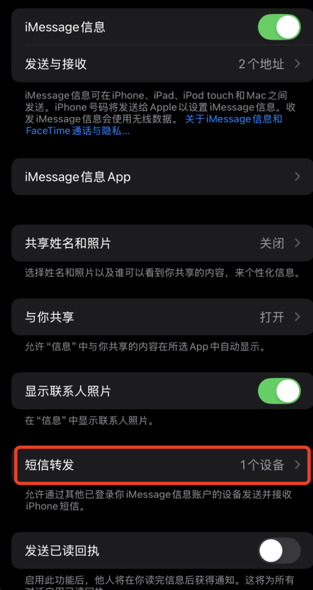
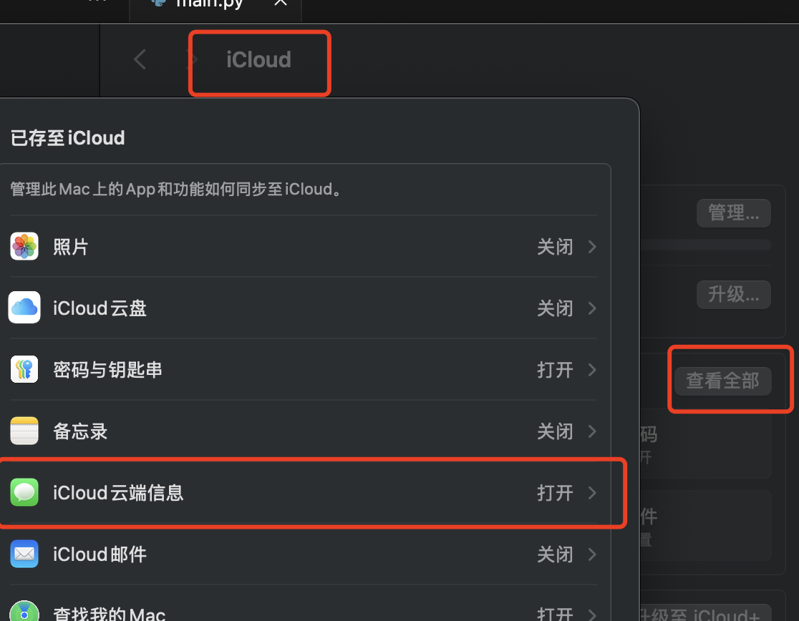

# imessage读取手机信息

突然想在Mac上对手机信息进行监控, 比如哪天出去Starbuck时, 连上wifi, 自动后台输入认证手机号, 读取手机短信, 并进行提交...

PS. 纯折腾, 用处...不能说没有, 只能说基本没必要

## 前置准备

1. iPhone上需要在 ***信息*** 开启消息转发, 开启icloud同步.

   在里面将其所希望接收、同步信息的Mac进行开启即可

   
   

   
2. MacOS上同样需要将其icloud同步打开, 

   在 ***设置 -> AppleID -> iCloud -> 查看全部*** 打开即可

   

3. 对需要读取的软件(Terminal, DBeaver, VSCode等)添加完全磁盘访问权限

   在 ***设置 -> 隐私与安全性 -> 完全磁盘访问权限*** 打开所需的软件即可, 比如测试时的Terminal终端, IDE, 或打包出来的软件
   
   
   
至此, 准备工作已完成

## 消息位置

每一个AppleID登录, 都属于不同的用户, 即哪怕是多用户使用的MacOS, 故消息数据库是分别存放于自己用户目录下的, 位于 **~/Library/Messages/chat.db**

```shell
$ ls ~/Library/Messages/chat.db
/Users/${your username}/Library/Messages/chat.db
```

该文件是SQLite3数据库文件, 直接打开即可(需要前面所设置的Full Disk Access权限)

```shell
$ sqlite3 ~/Library/Messages/chat.db
SQLite version 3.45.3 2024-04-15 13:34:05
Enter ".help" for usage hints.
sqlite> .tables
_SqliteDatabaseProperties                 
attachment                                
chat                                      
chat_handle_join                          
chat_message_join                         
chat_recoverable_message_join             
deleted_messages                          
handle                                    
kvtable                                   
message                                   
message_attachment_join                   
message_processing_task                   
recoverable_message_part                  
scheduled_messages_pending_cloudkit_delete
sync_deleted_attachments                  
sync_deleted_chats                        
sync_deleted_messages                     
unsynced_removed_recoverable_messages     
sqlite>
```

这里就不对其结构进行细细研究, 因为不做深度定制, 不需要理会其结构, 而且也不难.

## 获取消息

直接给出SQL

```sql
SELECT 
    chat.ROWID AS chat_id,
    message.ROWID AS message_id, 
    chat.account_login AS apple_id,
    message.service AS message_type,
    datetime(message.date/1000000000 + strftime('%s','2001-01-01'), 'unixepoch', 'localtime') AS message_date_str,
    message.date AS message_date,
    CASE message.is_from_me
        WHEN 1 THEN message.destination_caller_id
        ELSE chat.chat_identifier
    END AS sender,
    CASE message.is_from_me
        WHEN 0 THEN message.destination_caller_id
        ELSE chat.chat_identifier
    END AS receiver,
    message.attributedBody AS format_text
FROM 
    message
JOIN
    chat_message_join ON chat_message_join.message_id = message.ROWID
JOIN
    chat on chat.ROWID = chat_message_join.chat_id
JOIN 
    handle ON message.handle_id = handle.ROWID
JOIN (
    SELECT
        chat.ROWID AS chat_id,
        MAX(message.date) AS max_date
    FROM
        chat
    JOIN
        chat_message_join ON chat.ROWID = chat_message_join.chat_id
    JOIN
        message ON message.ROWID = chat_message_join.message_id
    GROUP BY
        chat.ROWID
) max_dates ON chat.ROWID = max_dates.chat_id
ORDER BY 
    max_dates.max_date DESC,
    message.date DESC
```

其中JOIN子查询及第一个ORDER-BY为对chat聊天组进行排序, 取所有聊天组的 **最后更新** 时间作为第一层排序

第二个ORDER-BY为对排序后的 **聊天组** , 其内部消息再排序.

人话讲, 就是显示的跟打开短信软件看到的一样. 使用时不断拼接到一个聊天框, 等到chat_id不一致后, 切换一个聊天框. 

> 需要注意的是, 这里并不是直接取`message.text`, 由于其不知道的原因, 其并不一定有值, 都是以blob存储在`message.attributedBody`中
> 虽然直接读也能知道消息, 但还是进行一些简单的解析, 
> 解析代码在main.py中